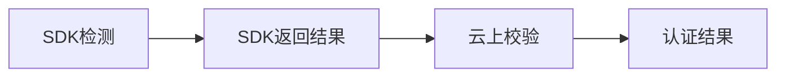

#  CLLivingDetectSDK集成文档


[活体文档](https://antchain.antgroup.com/docs/11/164941)
---
## 验证流程



### 1. SDK初始化
### 2. 设置配置，可不配置

### 3. 开启活体检测，返回本地验证结果及验证id

### 4. 使用验证id校验认证结果

>  需要用户服务端对接服务端来进行校验认证，用户app调用自身服务端接口

---
## 集成流程
| SDK            | 下载地址     |
| -------------- | ------------ |
| iOS SDK-V1.0.0 | [下载地址]() |
| Demo           | [下载地址]() |

### 1.添加隐私权限

*  **Privacy - Camera Usage Description**

* **Privacy - NSUserTrackingUsageDescription**

  > ps:参考文案“请放心，开启权限不会获取您在其他APP或网站的隐私信息，该权限仅用于标识设备并保障认证流程安全

### 2.Xcode关闭Bitcode选项

**Build Setting** -搜索Enable Bitcode -修改设置为**NO**

### 3.在 Xcode 编译设置的 Linking > **Other Linker Flags** 中，添加设置 **-ObjC**
### 4.导入iOS SDK包

#### SDK包
```
MPRemoteLogging
BioAuthEngine
ZolozUtility
AliyunIdentityManager
APBToygerFacade
BioAuthAPI
ToygerService
ZolozSensorServices
ZolozMobileRPC
APPSecuritySDK
OCRDetectSDKForTech
ToygerNative
ZolozUIModule
```
#### 系统依赖库
```
CoreGraphics.framework
Accelerate.framework
SystemConfiguration.framework
AssetsLibrary.framework
CoreTelephony.framework
QuartzCore.framework
CoreFoundation.framework
CoreLocation.framework
ImageIO.framework
CoreMedia.framework
CoreMotion.framework
AVFoundation.framework
WebKit.framework
libresolv.tbd
libz.tbd
libc++.1.tbd
libc++abi.tbd
AudioToolbox.framework
CFNetwork.framework
MobileCoreServices.framework
libz.1.2.8.tbd
AdSupport.framework
```
#### 拷贝资源文件
选择 TARGETS ，点击 Build Phases 标签页，在 Copy Bundle Resources 中添加如下四个 bundle：

* APBToygerFacade.bundle：位于 APBToygerFacade.framework 中。
* BioAuthEngine.bundle：位于 BioAuthEngine.framework 中。
* OCRXMedia.bundle: 所在位置为 OCRDetectSDKForTech.framework 中。
* ToygerNative.bundle: 所在位置为 ToygerNative.framework 中

## SDK使用
#### 1.前往官网创建app项目，生成appId

[控制台地址](https://www.shanyan253.com)

#### 2. 引用SDK头文件

```
#import <CLLivingDetectSDK/CLLivingDetectSDK.h>
```
#### 3.初始化

```
[CLLivingDetectManager initWithAppId:APPID];
```

#### 4.配置参数（可不配置，使用默认）

> CLLvingConfig * config = [CLLvingConfig defaultConfig]; 
* 配置活体检测进度条颜色，类型为字符串，格式为@"#FFFFFF"。

```
/// 扫脸圆圈颜色，默认为蓝色，颜色格式为 @"#FFFFFF"
@property(nonatomic, strong) NSString * faceCircleColor;
```

* 是否返回活体检测图片，默认不返回。

```
/// 是否返回图片，默认为@(NO)
@property(nonatomic, strong)NSNumber * returnImage;
```

* SDK内部获取校验信息超时时间设置，默认时间为5s。

```
/// 验证请求超时时间设置
@property(nonatomic, strong) NSNumber * vertifyOutTime;
```

* 是否返回录制视频地址，默认不返回。

```
/// 是否返回录制视频地址，默认不返回，格式@(YES) or @(NO)
@property(nonatomic, assign) NSNumber * returnVideo;
```

* 活体检测动作设置。

```
/// 活体检测动作
///（默认）眨眼动作活体检测；
/// CLLivingVertifyActionMulti：多动作活体检测，眨眼+任意摇头检测
@property(nonatomic, assign) CLLivingVerifyAction vertifyAction;
```
#### 5.开启活体校验
```
/// 开启活体校验
/// @param viewController 当前显示viewcontroller
/// @param completion 返回结果
+ (void)startVerifyWithViewController:(UIViewController *)viewController
                            completion:(void(^)(CLLivingResult * result))completion
```

> viewController 当前页面视图控制器，用于弹出活体页面

**活体检测返回结果：**

```
@interface CLLivingResult : NSObject
/// SDK返回外层码
@property (nonatomic, assign, readonly)NSInteger code;
/// SDK返回响应描述
@property (nonatomic, strong, readonly)NSString * message;
/// SDK内层码
@property (nonatomic, assign )NSInteger  innerCode;
/// SDK内层描述，可查看具体原因
@property (nonatomic, strong )NSString * innerMessage;
/// SDK报错，返回错误信息
@property (nonatomic, strong, readonly)NSError * error;
/// SDK额外信息，一般为空
@property (nonatomic, strong)id ext;
/// SDK 活体检测后返回详细信息
@property (nonatomic, strong)CLLivingDetectResponse * response;
```

#### 6.版本号

```
/// 返回SDK版本号
+ (NSString *)getVersion;
```

